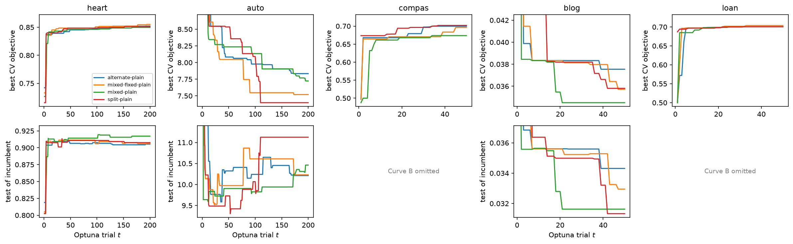

# HP-search sensitivity

How much does each flavor's tuned result depend on the Optuna trial budget? The
[base-result bake-off](alternate-base-result.md) showed the per-flavor verdicts
are budget-dependent — `alternate` went from 0/5 to 2/5 datasets between a
25–50-trial budget and the paper's per-dataset counts, and tiny `auto`
*meta-overfits* the CV objective at 200 trials. This page reconstructs, per
`(dataset, flavor)`, how the tuned result evolves with trial count, directly
from the committed Optuna storage (`benchmarks/results/alternate-base/studies/`)
— **no re-run of the search**.

Two curves per study (design in
`docs/superpowers/specs/2026-07-15-hp-search-sensitivity-curves-design.md`):

- **Curve A — best-so-far CV objective vs trial** (top row). The search's
  convergence for a **single TPE run** (sampler seed 0), read straight from each
  trial's stored objective value. Monotone by construction. (The bad first-trial
  value is clipped off the top of each panel so the converged detail is visible.)
- **Curve B — test metric of the running incumbent vs trial** (bottom row). At
  each trial, the held-out test metric of the best-objective config so far.
  *Not* monotone: when it turns away from Curve A — CV still improving while
  test degrades — the search is meta-overfitting. Reconstructed by
  re-evaluating only the best-so-far changepoints (a handful per study), a
  5-seed IQM trend estimate. Curve B is shown for `heart`/`auto`/`blog`; it is
  **omitted for `compas`/`loan`** (`# re-eval = 0` below) — the re-eval is serial
  and compute-heavy today (`loan` especially, at 419k rows), and a
  parallel + resumable re-eval (see Follow-ups) will fill them in cheaply.
  `blog` values are MSE (the search metric), not the RMSE headline.



## On the lines (why no shaded band)

Each curve is a **single solid line**, not a mean with a shaded variance band,
and this is deliberate:

- **Curve A is one TPE trajectory** (seed 0). A run-to-run band would need `K`
  *independent sampler-seed* searches — TPE is adaptive (trial `t`'s config is
  chosen from the results of trials `1…t-1`), so its variance is a property of
  the whole search, not of any single trial. That is a **planned follow-up**
  ([`hp-search-sensitivity-curves-design.md`], follow-up 1); it costs a full
  re-run of every study per extra seed, so it is out of scope here.
- **The tempting free shortcut — resampling the trial *order* of one run — is
  invalid for TPE.** It would be correct only if the trials were exchangeable
  (random/grid search, à la Dodge et al. 2019, *expected validation
  performance*). Under TPE they are not: a good config discovered at trial 90
  exists *because* earlier trials found it, so permuting it to `t=1` reports a
  budget-vs-quality relationship no real short run could achieve — it makes the
  search look like it saturates earlier than it does, misleading the very
  reading this figure is for. So we do not draw a permutation band.
- **Curve B is a 5-seed IQM point** per changepoint; the per-seed spread is not
  currently carried through to a band.

The single lines are therefore honest point estimates, not noise-free claims;
seed-variance bands are the follow-up.

## Saturation

`t*(0.99)` is the smallest trial count that reaches 99% of the eventual gain in
Curve A; a study is *saturated* (✅) when `t* ≤ 0.8 × trials` — it found
essentially its best config comfortably within budget. `⚠️` marks studies still
improving near the end of the budget.

| dataset | flavor | trials | t*(0.99) | saturated | # re-eval |
|---|---|--:|--:|:-:|--:|
| heart | alternate-plain | 200 | 130 | ✅ | 13 |
| heart | mixed-fixed-plain | 200 | 177 | ⚠️ | 12 |
| heart | mixed-plain | 200 | 125 | ✅ | 13 |
| heart | split-plain | 200 | 152 | ✅ | 11 |
| auto | alternate-plain | 200 | 12 | ✅ | 19 |
| auto | mixed-fixed-plain | 200 | 78 | ✅ | 14 |
| auto | mixed-plain | 200 | 11 | ✅ | 17 |
| auto | split-plain | 200 | 4 | ✅ | 20 |
| compas | alternate-plain | 50 | 33 | ✅ | 0 |
| compas | mixed-fixed-plain | 50 | 45 | ⚠️ | 0 |
| compas | mixed-plain | 50 | 34 | ✅ | 0 |
| compas | split-plain | 50 | 37 | ✅ | 0 |
| blog | alternate-plain | 50 | 39 | ✅ | 6 |
| blog | mixed-fixed-plain | 50 | 43 | ⚠️ | 8 |
| blog | mixed-plain | 50 | 18 | ✅ | 7 |
| blog | split-plain | 50 | 3 | ✅ | 8 |
| loan | alternate-plain | 50 | 15 | ✅ | 0 |
| loan | mixed-fixed-plain | 50 | 23 | ✅ | 0 |
| loan | mixed-plain | 50 | 15 | ✅ | 0 |
| loan | split-plain | 50 | 32 | ✅ | 0 |

Regenerate (parallel across GPUs via the shared launcher pool):

```bash
uv run --group bench python -m benchmarks.sensitivity run \
    --storage-dir benchmarks/results/alternate-base/studies \
    --curves-dir benchmarks/results/alternate-base/curves \
    --out docs/_static/hp-search-sensitivity \
    --devices cuda:0,cuda:1,cuda:0,cuda:1 --test-seeds 5
```

## What it shows

**`auto` meta-overfits — the headline.** On tiny `auto` (314 rows) Curve B
turns *away* from Curve A: the CV objective keeps improving through all 200
trials while the incumbent's **test** MSE gets worse. `split` is the clearest —
its test bottoms out near ~9.3 around trial 40, then climbs to ~11.1 by trial
110 and stays there; `mixed-fixed` shows the same rise (~9.5 → ~10.9). So past
~40 trials the search buys CV gains that don't generalize. This is exactly why
`auto`'s 200-trial numbers are read cautiously on the base-result page.

**Big data doesn't — the contrast.** On `blog` (47k rows) Curve B tracks Curve
A *downward*: the incumbent's test MSE keeps falling as the CV objective
improves, no divergence. Meta-overfitting is a small-data phenomenon at these
budgets.

**Saturation.** `split` finds its best config almost immediately on the larger
datasets (`blog` `t*=3`, `auto` `t*=4`) — the `|W|` variants and `alternate`
take longer to converge. `heart` is the outlier: every flavor keeps improving
its CV objective late (`t*` = 125–177 of 200, `mixed-fixed` never comfortably
saturating), yet Curve B is essentially flat — the late CV gains on this small,
noisy dataset are not real generalization. Where a study is `⚠️` and its Curve B
is flat or rising, the extra budget is not buying test performance.

**Takeaway.** The paper's larger budgets (200 for `heart`/`auto`) are past the
point of useful CV convergence on the small datasets and, on `auto`, actively
into meta-overfitting territory — a lighter budget would give a more honest test
estimate there. The prospective `log_test_trajectory` flag on
`benchmarks._common.search.search` records the test metric per trial during the
search, so future studies get Curve B for free (no incumbent re-eval).

## Follow-ups

- **Sampler-seed band on Curve A.** The lines are single TPE trajectories (one
  seed); a genuine run-to-run band needs `K` independent sampler-seed searches
  per `(dataset, flavor)` — a full re-run each. (The tempting free shortcut of
  resampling one run's *trial order* is invalid for TPE — its trials aren't
  exchangeable, so a permutation band would understate the budget needed.)
- **Parallel + resumable re-eval.** The Curve-B re-eval is serial and
  launch-bound today (one process, one core, GPUs mostly idle), and writes only
  at the end (no resume). Fanning the independent incumbent re-evals across the
  device pool and memoizing `trial → test IQM` would make it ~10–20× faster and
  restartable — then `compas`/`loan` Curve B fill in cheaply. A per-incumbent
  progress log is already in `extract`.
- **Adopt `log_test_trajectory`** for dedicated sensitivity runs so Curve B is
  free from storage (no re-eval at all).
