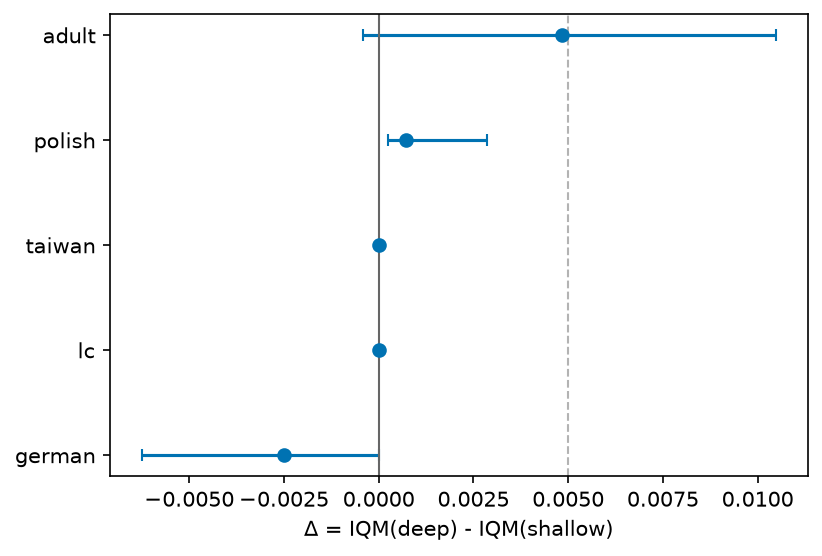

# Large-dataset monotonic-depth screen

Screens deep vs shallow `absolute`-residual monotone stacks at each dataset's
full train size, and routes each dataset by the gate (Δ significant *and* ≥ the
practical margin) to a full [size-ladder](loan-size-ladder.md) study or the
standard benchmark. Method: {doc}`protocol` and the
[design spec](https://github.com/davorrunje/mononet/blob/main/docs/superpowers/specs/2026-07-11-large-dataset-screen-design.md).

A vector copy (`docs/_static/large-dataset-screen.pdf`) is committed for LaTeX.

## Results

Accuracy IQM over 8 test seeds per arm; Δ = IQM(deep) − IQM(shallow) with a 95%
seed-bootstrap band. Both arms are `absolute` monotone residual stacks tuned
independently (deep depth ∈ {6, 10, 16}; shallow ∈ [1, 4]). Gate: advance to a
[size-ladder](loan-size-ladder.md) iff Δ_lo > 0 **and** Δ ≥ 0.005; else fold into
the standard benchmark.

| dataset | N (train) | deep IQM | shallow IQM | Δ [95% CI] | verdict |
|---|--:|--:|--:|--:|:--|
| german | 800 | 0.7075 | 0.7100 | −0.0025 [−0.0062, +0.0000] | standard |
| polish | 8 402 | 0.9529 | 0.9522 | +0.0007 [+0.0002, +0.0029] | standard |
| taiwan | 24 000 | 0.7788 | 0.7788 | +0.0000 [0, 0] | standard |
| adult | 24 129 | 0.7858 | 0.7809 | +0.0048 [−0.0004, +0.0105] | standard |
| lc | 829 347 | 0.7871 | 0.7871 | +0.0000 [0, 0] | standard |

## Interpretation

**Monotone depth does not clear the gate on any dataset**, from 800 to 829k rows
— every dataset routes to the standard benchmark, none to a ladder. This
corroborates the [loan size-ladder](loan-size-ladder.md) (no dose-response in N)
across new domains and scales: deep `absolute`-residual stacks match, and never
beat, shallow ones.

Notes:

- **adult** is the only near-signal (Δ = +0.0048, deep marginally better) but
  misses *both* gate criteria — its CI touches 0 and the point is below the 0.005
  margin.
- **polish** shows the gate working as intended: Δ is *statistically* positive
  (Δ_lo = +0.0002 > 0) but *practically* trivial (< 0.005), so it is correctly
  routed to `standard` rather than triggering an expensive ladder.
- **taiwan** and **lc** collapsed to their majority base rates on *both* arms
  (Δ = 0 with zero variance) — an accuracy ceiling on the imbalanced targets, not
  a depth effect. A ranking-metric (AUC/PR) re-score is a tracked follow-up to
  confirm no depth signal is hidden below the accuracy ceiling.

The "why depth does not help" question is investigated theoretically in the
[synthetic-probe design](https://github.com/davorrunje/mononet/blob/main/docs/superpowers/specs/2026-07-12-monotone-depth-synthetic-probe-design.md).
