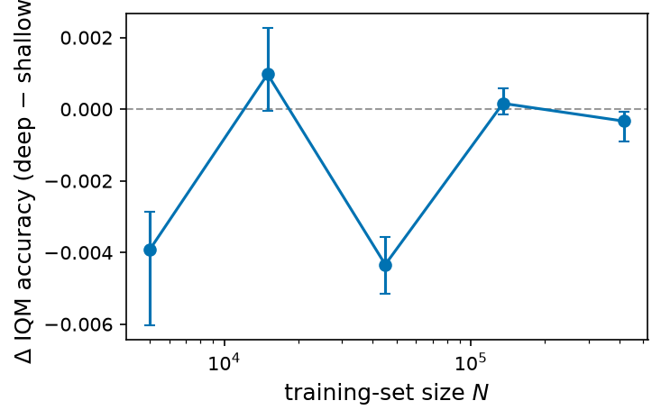

# Loan size-ladder — does depth win with scale?

PR #72 found deep monotone residual stacks beat shallow ones **only** on
`loan`, the largest dataset. This experiment isolates the cause: it holds
`loan` fixed and varies the training-set size N, tuning a **deep** (`mixed`
residual, depth ∈ {6, 10, 16}) and a **shallow** (`mixed` residual, depth ∈
[1, 4]) arm independently at each N, then reports

$$\Delta(N) = \mathrm{IQM}_{\text{deep}}(N) - \mathrm{IQM}_{\text{shallow}}(N)$$

on the full held-out test set (10 seeds per arm; a fresh stratified
N-subsample per seed, so the IQM band captures subsample and training
variance). Method and protocol: {doc}`protocol` and the
[design spec](https://github.com/davorrunje/mononet/blob/main/docs/superpowers/specs/2026-07-10-loan-size-ladder-design.md).

A vector copy (`docs/_static/loan-size-ladder.pdf`) is committed alongside for
LaTeX (`\includegraphics{loan-size-ladder.pdf}`).

## Results

Accuracy IQM over 10 test seeds per arm; `L` = effective monotone layers
(`L = 2·depth + 2`); Δ = IQM(deep) − IQM(shallow) with a 95% seed-bootstrap band.

| N (train) | deep IQM (L) | shallow IQM (L) | Δ [95% CI] |
|---:|---|---|---|
| 5 000 | 0.6392 (14) | 0.6431 (8) | −0.0039 [−0.0060, −0.0029] |
| 15 000 | 0.6454 (22) | 0.6445 (8) | +0.0010 [−0.0000, +0.0023] |
| 45 000 | 0.6459 (34) | 0.6503 (10) | −0.0043 [−0.0052, −0.0036] |
| 135 000 | 0.6480 (22) | 0.6478 (10) | +0.0002 [−0.0001, +0.0006] |
| full (~419k) | 0.6481 (14) | 0.6485 (10) | −0.0003 [−0.0009, −0.0001] |

No seeds collapsed in any cell.

## Interpretation

**Depth does not pay off with scale on `loan`.** Δ(N) shows no dose-response: it
is negative or statistically indistinguishable from zero at every rung, and at
full size the deep arm is marginally *worse* (Δ = −0.0003). The deep arm keeps
*selecting* large depths (6–16) but they never beat a 3–4-layer shallow residual
stack.

This revises the earlier reading (PR #72) that "depth helps only on `loan`":
that signal was a ≈0.001 IQM edge of a **deep-residual** stack over a
**plain-shallow** one — a comparison that conflates residual-vs-plain with
deep-vs-shallow. Isolating depth (residual vs residual, tuned independently per
N) erases it. The scaling hypothesis is not supported on `loan`.
